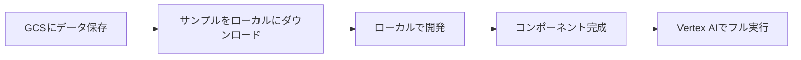

# ローカル実行 vs クラウド実行 比較ガイド

## 概要

このMLパイプラインシステムは、**ローカル実行**と**Vertex AI（クラウド）実行**の両方に対応しています。すべてのコンポーネントは両方の環境で動作するよう設計されています。

---

## 📊 機能比較表

| 機能 | ローカル実行 | Vertex AI実行 | 備考 |
|------|-------------|---------------|------|
| **データソース** | ローカルファイル or GCS | GCS | GCSは両方で利用可能 |
| **モデル保存先** | ローカルディスク or GCS | GCS | GCSは両方で利用可能 |
| **並列実行** | ❌ 順次実行 | ✅ 真の並列実行 | Vertex AIは4ジョブ同時実行可能 |
| **スケーラビリティ** | マシンスペックに依存 | 無限スケール | クラウドリソースを動的に割り当て |
| **実験トラッキング** | ローカルファイル | Vertex AI Experiments | クラウドで自動集約・可視化 |
| **コスト** | ゼロ（自前マシン） | 従量課金 | 約$0.50-1.00/実行 |
| **セットアップ** | 簡単（venv） | 認証・権限設定が必要 | 初回のみ設定が必要 |
| **デバッグ** | 簡単（ローカル） | ログ確認が必要 | Vertex AI Consoleで確認 |

---

## 🔧 実行方法の違い

### ローカル実行

```cmd
# 1. 仮想環境を有効化
venv\Scripts\activate

# 2. ローカルデータで実行
python src\train.py

# または、個別コンポーネントをテスト
python -m src.components.training.random_forest
```

**特徴**:
- ✅ 即座に実行開始
- ✅ デバッグが容易
- ✅ ネットワーク不要
- ❌ 並列実行は手動で管理が必要
- ❌ 大規模データには不向き

### Vertex AI実行

```cmd
# 1. パイプラインをコンパイル
python run_pipeline.py

# 2. Vertex AIに提出（プロンプトで'y'）
[SUBMIT?] Submit to Vertex AI? [y/N]: y
```

**特徴**:
- ✅ 自動並列実行（4ジョブ）
- ✅ スケーラブル
- ✅ 実験トラッキング
- ✅ 再現性が高い
- ❌ 初回セットアップが必要
- ❌ 実行開始まで時間がかかる

---

## 📁 データ処理の互換性

### コンポーネントの自動対応

すべてのコンポーネントはGCS/ローカルを自動判別：

```python
# random_forest_componentの例
if model_output_path.startswith("gs://"):
    # GCSに保存
    import gcsfs
    fs = gcsfs.GCSFileSystem()
    with fs.open(model_output_path, 'wb') as f:
        joblib.dump(model, f)
else:
    # ローカルに保存
    os.makedirs(os.path.dirname(model_output_path), exist_ok=True)
    joblib.dump(model, model_output_path)
```

**対応パターン**:
```python
# GCS
data_path = "gs://trade-mlops-bucket/data/stock.csv"
model_path = "gs://trade-mlops-bucket/models/model.pkl"

# ローカル
data_path = "data/stock.csv"
model_path = "models/model.pkl"
```

---

## 🎯 使い分けの推奨

### ローカル実行が適している場合

1. **開発・デバッグ段階**
   - コンポーネントの動作確認
   - パラメータチューニング
   - エラー修正

2. **小規模データ**
   - サンプル数 < 10,000
   - 特徴量 < 100
   - 実行時間 < 5分

3. **プロトタイピング**
   - アイデアの検証
   - 新しいコンポーネントのテスト

**実行例**:
```cmd
# データ生成
python scripts\generate_sample_data.py 100 data\test.csv

# ローカルで学習
python src\train.py --data data\test.csv --features Open,Close,Volume
```

### Vertex AI実行が適している場合

1. **本番環境**
   - 定期的なモデル再学習
   - 自動化されたワークフロー

2. **大規模実験**
   - 複数の特徴量組み合わせ
   - ハイパーパラメータ探索
   - グリッドサーチ

3. **チーム協業**
   - 実験結果の共有
   - モデルバージョン管理
   - 再現性の確保

**実行例**:
```cmd
# データをGCSにアップロード
python scripts\upload_to_gcs.py

# Vertex AIで並列実験
python run_pipeline.py  # 'y' で提出
```

---

## 🔄 ハイブリッド実行パターン

### パターン1: ローカル開発 → クラウド本番


### パターン2: クラウドデータ → ローカル開発



---

## 💻 ローカル実行の具体例

### ステップ1: サンプルデータ生成

```cmd
venv\Scripts\activate
python scripts\generate_sample_data.py 1000 data\stock.csv
```

### ステップ2: 個別コンポーネントのテスト

#### 前処理
```python
# Python対話モードで
from src.components.preprocessing.standard_scaler import standard_scaler_component

result = standard_scaler_component(
    input_data_path="data/stock.csv",
    output_data_path="data/processed.csv",
    fillna_strategy="forward_fill"
)
```

#### 学習
```python
from src.components.training.random_forest import random_forest_component

metrics = random_forest_component(
    data_path="data/processed.csv",
    features="Open,Close,Volume",
    model_output_path="models/local_model.pkl",
    n_estimators=50
)
print(metrics)
```

### ステップ3: 既存のtrain.pyを使用

```cmd
python src\train.py ^
    --data data\stock.csv ^
    --features Open,Close,Volume ^
    --n_estimators 100 ^
    --model_output models\test_model.pkl
```

---

## ☁️ Vertex AI実行の具体例

### ステップ1: 設定ファイルの編集

[`config/pipeline_config.yaml`](file:///d:/work/AI-Trade/TradeML_MLOps/config/pipeline_config.yaml):

```yaml
data:
  raw_data_path: "gs://trade-mlops-bucket/data/stock.csv"  # GCSパス

experiments:
  mode: "grid_search"
  feature_combinations:
    - ["Open", "Close"]
    - ["Open", "Close", "Volume"]
    - ["Open", "High", "Low", "Close", "Volume"]
    - ["RSI", "MACD", "SMA_20"]
```

### ステップ2: データアップロード

```cmd
python scripts\upload_to_gcs.py
```

### ステップ3: パイプライン実行

```cmd
python run_pipeline.py
# 'y' で提出
```

### ステップ4: 結果の確認

```cmd
# モニタリング
# https://console.cloud.google.com/vertex-ai/pipelines

# 結果ダウンロード
python scripts\list_gcs_files.py models/
gsutil cp gs://trade-mlops-bucket/reports/experiment_comparison.md reports/
```

---

## 🧪 テスト戦略

### ローカルでの単体テスト

```cmd
# システムテスト
python test_system.py

# 個別コンポーネントテスト
python -m pytest tests/  # pytest使用の場合
```

### Vertex AIでの統合テスト

```cmd
# 小規模データでパイプライン検証
# 1. config/pipeline_config.yamlで特徴量組み合わせを1つに
# 2. 実行
python run_pipeline.py
```

---

## 📋 設定の切り替え

### 環境変数での切り替え

```cmd
# ローカル実行
set DATA_PATH=data\stock.csv
set MODEL_OUTPUT=models\model.pkl

# クラウド実行
set DATA_PATH=gs://trade-mlops-bucket/data/stock.csv
set MODEL_OUTPUT=gs://trade-mlops-bucket/models/model.pkl
```

### YAMLファイルでの切り替え

```yaml
# ローカル用設定（例: config/pipeline_config_local.yaml）
data:
  raw_data_path: "data/stock.csv"
  processed_data_path: "data/processed.csv"

experiments:
  mode: "single"  # ローカルは1つずつ実行
  feature_combinations:
    - ["Open", "Close"]  # テスト用に1つだけ
```

```cmd
# ローカル設定で実行
python run_pipeline.py config/pipeline_config_local.yaml
```

---

## ⚡ パフォーマンス比較

| 項目 | ローカル (Core i7, 16GB RAM) | Vertex AI (n1-standard-4) |
|------|------------------------------|---------------------------|
| 1000サンプル、3特徴量 | 約30秒 | 約2分（起動含む） |
| 10,000サンプル、10特徴量 | 約5分 | 約3分 |
| 4並列実験 | 約20分（順次） | 約5分（並列） |
| 100,000サンプル、50特徴量 | メモリ不足の可能性 | 約15分 |

---

## 🔍 トラブルシューティング

### ローカル実行のエラー

**問題**: `ModuleNotFoundError`
```cmd
# 解決方法
venv\Scripts\activate
pip install -r requirements.txt
```

**問題**: メモリ不足
```python
# 解決方法: データをサンプリング
df = pd.read_csv('data/stock.csv')
df_sample = df.sample(n=1000)  # 1000サンプルに削減
```

### Vertex AI実行のエラー

**問題**: 権限エラー
```cmd
# 解決方法
# docs/gcs_permission_setup.md を参照
```

**問題**: データが見つからない
```cmd
# 解決方法
python scripts\upload_to_gcs.py
python scripts\list_gcs_files.py data/  # 確認
```

---

## 📊 コスト最適化

### ローカル → クラウドの移行戦略

1. **ローカルで開発** (コスト: $0)
   - プロトタイプ作成
   - 小規模データでテスト

2. **クラウドで検証** (コスト: $0.50)
   - 1回の小規模実行
   - パイプラインの動作確認

3. **クラウドで本番実行** (コスト: $1-5)
   - 大規模データ
   - 複数実験

**月間コスト例**:
- 開発: ローカルのみ → $0
- 週1回の検証: 4回 × $0.50 = $2/月
- 毎日実行: 30回 × $1 = $30/月

---

## ✅ まとめ

### ローカル実行
- ✅ 開発・デバッグに最適
- ✅ コストゼロ
- ✅ 即座に実行
- ❌ スケールしない

### Vertex AI実行
- ✅ 本番環境に最適
- ✅ 並列実行
- ✅ 自動トラッキング
- ❌ セットアップが必要

### 推奨アプローチ
**ローカルで開発 → Vertex AIで本番** のハイブリッド戦略が最適！

---

## 🔗 関連ドキュメント

- ローカルセットアップ: [README.md](file:///d:/work/AI-Trade/TradeML_MLOps/README.md)
- Vertex AI実行:  [docs/vertex_ai_execution_guide.md](file:///d:/work/AI-Trade/TradeML_MLOps/docs/vertex_ai_execution_guide.md)
- 権限設定: [docs/gcs_permission_setup.md](file:///d:/work/AI-Trade/TradeML_MLOps/docs/gcs_permission_setup.md)

---

## 結果の同一性（Parity）の確保

ローカル実行とクラウド実行で同一の結果を得るためには、以下の条件を揃える必要があります：

1. **ライブラリのバージョン**: `scikit-learn`, `numpy`, `pandas` 等のバージョンを完全に一致させる。
2. **乱数シード**: `random_state` をすべてのコンポーネントで固定する。
3. **データ前処理**: ローカルでもパイプラインコンポーネント（StandardScaler等）と同じ前処理を適用する。

> [!IMPORTANT]
> 検証の結果、ライブラリバージョンとハイパーパラメータを一致させ、共通の前処理済みデータを使用することで、ローカルとクラウドで精度が小数点以下15桁まで一致（`0.546583850931677`）することを確認しました。
