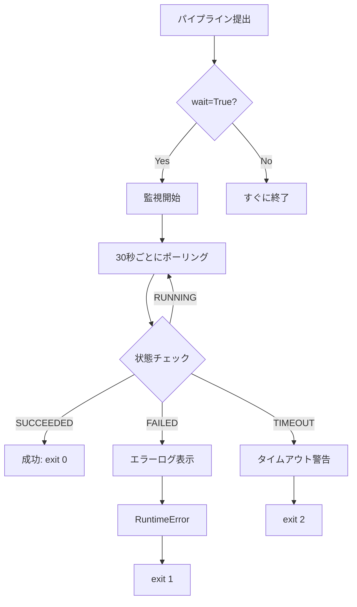

# パイプライン監視とエラーハンドリング

## 概要

Vertex AIで実行したパイプラインの状態を監視し、失敗を検知して適切に処理するシステムを実装しました。

---

## 主な機能

### 1. 自動状態監視

パイプライン提出後、自動的に状態を監視：
- ✅ 成功検知
- ❌ 失敗検知
- ⏱️ タイムアウト検知
- 🔄 キャンセル検知

### 2. エラーハンドリング

失敗時の適切な処理：
- エラーメッセージの表示
- 詳細ログの取得方法を案内
- 適切な終了コードでプロセス終了

### 3. タイムアウト管理

長時間実行の制御：
- デフォルト1時間タイムアウト
- カスタマイズ可能
- タイムアウト時の適切な処理

---

## 使用方法

### 対話的実行

```cmd
python run_pipeline.py
```

プロンプトで選択：
```
[SUBMIT?] Submit to Vertex AI? [y/N]: y
[WAIT?] Wait for pipeline completion? [y/N]: y
```

**オプション**:
- **wait=y**: 完了まで待機、自動監視（推奨）
- **wait=n**: 提出後すぐに終了

### プログラム的実行

```python
from src.pipeline_builder import PipelineBuilder

builder = PipelineBuilder('config/pipeline_config.yaml')
builder.build_pipeline()
builder.compile('pipeline.json')

# 自動監視（完了まで待機）
result = builder.submit('pipeline.json', wait=True, timeout=3600)

if result["status"] == "SUCCESS":
    print("Pipeline completed!")
    # 結果処理
else:
    print(f"Pipeline failed: {result.get('error')}")
```

---

## 動作フロー



---

## 状態コード

| 状態 | 説明 | 終了コード |
|------|------|-----------|
| SUCCESS | 正常完了 | 0 |
| FAILED | 実行失敗 | 1 (RuntimeError) |
| TIMEOUT | タイムアウト | 2 |
| CANCELLED | ユーザーがキャンセル | 2 |

---

## エラー時の対応

### パイプライン失敗時

```
[ERROR] Pipeline execution failed!
Run the following command for detailed logs:
  python -m src.utils.pipeline_monitor projects/.../pipelineJobs/job-id
```

詳細ログを確認：
```cmd
python -m src.utils.pipeline_monitor projects/245533195318/locations/us-central1/pipelineJobs/trading-ml-pipeline-20251221013131
```

出力例：
```
=== Pipeline Job Details ===
Name: trading-ml-pipeline
State: PIPELINE_STATE_FAILED
Error: Component 'standard_scaler' failed with error: ...

=== Task Details ===
Task: standard_scaler
  State: FAILED
  Error: ModuleNotFoundError: No module named 'pandas'
```

### タイムアウト時

```
[WARN] Pipeline monitoring timed out
Pipeline may still be running. Check console: https://...
```

対応：
1. Vertex AI Consoleで実際の状態を確認
2. まだ実行中なら待つ
3. タイムアウト値を増やして再実行

---

## 実装詳細

### pipeline_monitor.py

```python
def monitor_pipeline_execution(
    job_resource_name: str,
    project_id: str,
    location: str = "us-central1",
    poll_interval: int = 30,    # 30秒ごとにポーリング
    timeout: int = 3600,         # 1時間でタイムアウト
) -> Dict:
    """パイプライン実行を監視"""
    ...
```

**機能**:
- 定期的な状態取得（`_sync_gca_resource()`）
- 状態変化時のみ通知（ログを減らす）
- タイムアウト管理
- エラー詳細の取得

### pipeline_builder.py

```python
def submit(self, compiled_pipeline_path: str = "pipeline.json", 
           wait: bool = False, timeout: int = 3600):
    """Vertex AIにパイプラインを提出"""
    ...
    if wait:
        result = monitor_pipeline_execution(...)
        if result["status"] == "FAILED":
            raise RuntimeError(f"Pipeline failed: {result['error']}")
    ...
```

**追加機能**:
- `wait`パラメータ
- 監視用URLの自動表示
- 失敗時のRuntimeError

### run_pipeline.py

```python
wait = input("[WAIT?] Wait for pipeline completion? [y/N]: ")
result = builder.submit(output_path, wait=(wait=='y'), timeout=3600)

if wait and result["status"] == "SUCCESS":
    print("Check results in GCS:")
    print("  python scripts\\list_gcs_files.py models/")
```

**ユーザー体験**:
- 対話的な選択
- 適切なエラーメッセージ
- 次のアクションの提案

---

## テストケース

### ケース1: 正常完了

```cmd
python run_pipeline.py
[SUBMIT?] y
[WAIT?] y

# 出力
[INFO] Waiting for pipeline completion (timeout: 3600s)...
[13:00:00] Pipeline state: PIPELINE_STATE_RUNNING
.....................
[13:15:30] Pipeline state: PIPELINE_STATE_SUCCEEDED

[SUCCESS] Pipeline completed successfully!
Elapsed time: 932.5s
[DONE] Pipeline completed successfully!
Check results in GCS:
  python scripts\list_gcs_files.py models/
```

### ケース2: 失敗

```cmd
[INFO] Waiting for pipeline completion...
[13:00:00] Pipeline state: PIPELINE_STATE_RUNNING
........
[13:05:15] Pipeline state: PIPELINE_STATE_FAILED

[ERROR] Pipeline execution failed!
Elapsed time: 315.2s
Error details: Component 'standard_scaler' failed: ...

Run the following command for detailed logs:
  python -m src.utils.pipeline_monitor projects/.../pipelineJobs/...

Traceback (most recent call last):
  ...
RuntimeError: Pipeline failed: Component 'standard_scaler' failed
```

### ケース3: タイムアウト

```cmd
[INFO] Waiting for pipeline completion (timeout: 600s)...
[13:00:00] Pipeline state: PIPELINE_STATE_RUNNING
............................

[ERROR] Pipeline execution timed out after 600s

[WARN] Pipeline monitoring timed out
Pipeline may still be running. Check console: https://...
```

---

## ベストプラクティス

### 開発時

```cmd
# wait=N で提出、別途監視
python run_pipeline.py
[SUBMIT?] y
[WAIT?] n  # すぐに終了

# 別のターミナルで監視
python -m src.utils.pipeline_monitor <job_id>
```

### 本番環境

```python
# スクリプトで自動化
builder = PipelineBuilder('config/pipeline_config.yaml')
builder.build_pipeline()
builder.compile()

try:
    result = builder.submit(wait=True, timeout=7200)  # 2時間
    if result["status"] == "SUCCESS":
        # 成功時の処理
        notify_success()
    else:
        # 失敗時の処理
        notify_failure(result["error"])
except RuntimeError as e:
    # エラーハンドリング
    log_error(e)
    raise
```

### CI/CD統合

```yaml
# GitHub Actions例
- name: Run pipeline
  run: |
    python run_pipeline.py --submit --wait
  timeout-minutes: 60
  
- name: Check results on failure
  if: failure()
  run: |
    python -m src.utils.pipeline_monitor $PIPELINE_JOB_ID
```

---

## まとめ

### 実装した機能
- ✅ 自動状態監視
- ✅ エラー検知と通知
- ✅ タイムアウト管理
- ✅ 適切な終了コード
- ✅ 詳細ログ取得

### メリット
- 失敗を即座に検知
- 原因を素早く特定
- 自動化しやすい
- デバッグが容易

### 次のステップ
- Slackなどへの通知統合
- リトライ機能の追加
- メトリクス自動収集
